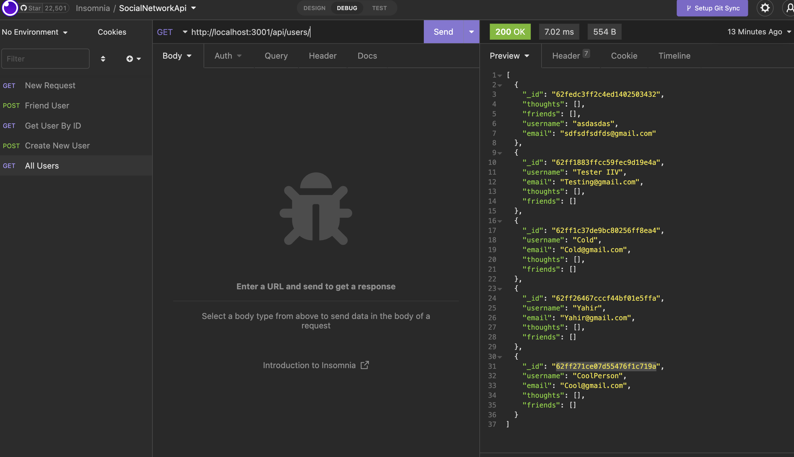

   <h1 align ="center">Social Network Api<h1>


## Description
The task was to creat a Social Networking api backend. Users should be able to create new accounts and users can be found via their id.
# Table of Contents
* [Description](#description)
* [Technologies](#technologies)
* [Installation](#installation)
* [License](#license)
* [Contributions](#contributions)
* [Github](#github)

## Showcase (click image for preview)
[](https://drive.google.com/file/d/1Njy9ZQPs73q3h14dEsAxBL6MSXPTEwyi/view)

## Technologies

<li>MongoDb</li>
<li>Js</li>
<li>Mongoose</li>

## Bugs
<li>Users currently can't friend users</li>
<li>User thoughts currently doesn't load properly</li>


## Installation
clone the repository into your local machine after do the following:

```bash
npm init -y
npm install
npm start
```
## License

<br>
This Project is licensed under the MIT license.

## Contributions


## Github
Questions? 
Contact me through my github Yahir-F

Email: placeholder@gmail.com


    